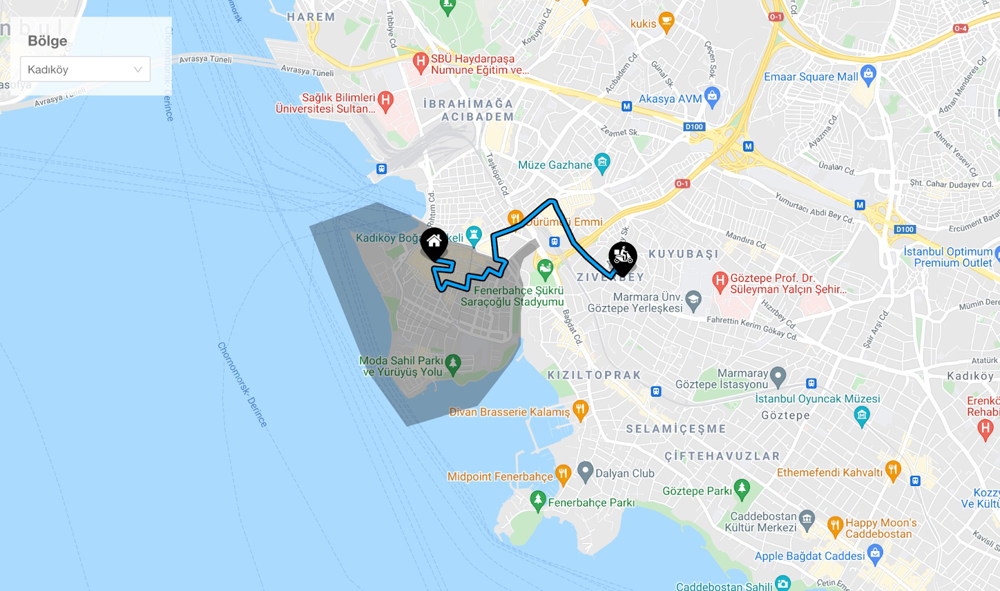

# Task: Hide the Flaws

## Overview

Despite a backend API that sometimes returns inconsistent results, your task is to ensure a seamless user experience. You can use a loading element that covers the entire screen until you receive a successful response from the API. Saving the successful results to the store may be an effective solution. The main goal is to create the interface as depicted in the provided screen image.



Utilizing the shared API, you must:

- Display region boundaries on the map.
- Show the courier's route and place marker objects on the map.

## Requirements

- Generate the Region dropdown menu using the list data from the `region` endpoint.
- Draw a Polygon object in gray using the `data.polygon.coordinates` data from the `region/{id}` endpoint.
- Use the `encodedPolyline` value from the relevant route object from returning the `route/{id}` endpoint.
- Place the marker objects (provided in the assets folder) at the start and end of the route.
- The polyline object must be drawn in accordance with the thickness and contour values shown in the reference image.
- Animate a courier icon along the route towards the delivery location.
- On screen refresh, the app should continue from the last selected region and the position where the courier marker was left.
- To ensure smooth working, add `x-force-correct: 1` to the API call headers. However, when submitting the task, set it to `x-force-correct: 0`.
- For API access, use the header value `x-api-key: Y2FuZGlkYXRlOkNFODIyN0xEOGFLODJiMWY1ODc2NzNSMEdmMw==`.

### Additional Details

- Any React Google Maps library can be used for this task.
- The center of the map can be determined using the `center` from the `region` object.
- **Nice to have:** Use `LatLngBounds` to center the drawn objects on the map. 

## API Documentation
**Base URL:** https://11o06niujd.execute-api.eu-west-1.amazonaws.com/dev

### 1. Health Check
#### Endpoint:

GET /health/check

#### Description:
Checks the health status of the service.

#### HTTP Status Code: 200 OK


#### Example Response:

```javascript
{
  "message": "OK"
}
```


### 2. Fetch All Regions
#### Endpoint:

GET /region

#### Description:
Fetches a list of all regions available in the database.

#### HTTP Status Code: 200 OK


#### Example Response:

```javascript
{
  "message": "Correct Response!",
  "list": [
    {
      "id": "region1",
      "name": "Region One"
    },
    {
      "id": "region2",
      "name": "Region Two"
    }
    // ... other regions
  ]
}
```

### 3. Fetch Specific Region by Region ID
#### Endpoint:

GET /region/region1


#### Description:
Fetches the details of a specific region based on the Region ID.

#### HTTP Status Code: 200 OK


#### Example Response:

```javascript
{
    "message": "Correct Response!",
    "data": {
        "_id": "region1",
        "center": {
            "coordinates": [
                28.893348111612784,
                41.03250472755143
            ],
            "type": "Point"
        },
        "polygon": {
            "type": "Polygon",
            "coordinates": [
                [
                    [
                        28.92032288400003,
                        41.03320597700008
                    ],
                    [
                        28.916846273000033,
                        41.03154347200007
                    ],
                    ...
                    ...
                    ...
                    [
                        28.919086220000054,
                        41.03563503100003
                    ],
                    [
                        28.92032288400003,
                        41.03320597700008
                    ]
                ]
            ]
        },
        "isActive": true,
        "name": "Region One",
        "city": "istanbul",
        "county": "esenler"
    }
}
```

### 4. Fetch Specific Route by Region ID
#### Endpoint:

GET /route/region1


#### Description:
Fetches the details of a specific route based on the Region ID.

#### HTTP Status Code: 200 OK


#### Example Response:

```javascript
{
    "message": "Correct Response!",
    "data": {
        "regionId": "region1",
        "encodedPolyline": "airyFo~doDh@ZpAsH........BTy@f@sAr@cBsA{@{@~AY`A"
    }
}
```

#### Critical Point:
As long as you request `x-force-correct: 0` in the header, the API will often return the following error and rarely return a successful result. As you get an error, you should try again until you reach the correct result and not reflect this situation to the user.

Usually you will get this error:

#### HTTP Status Code: 500 Internal Server Error


#### Example Response:

```javascript
{
    "message": "Something went wrong!"
}
```

### Guidelines:

-   Modularize your code. Separate functionalities into different modules or functions.
-   Ensure your code is readable and well-commented.
-   Include a comprehensive set of tests for your solution.
-   Use code formatting and linting best practices.

### Evaluation Points

- Divide the solution into as many small components as possible.
- Commit your code in small chunks to provide a clear history of your development process.

## Submission

Once you're done with the implementation, please ensure that:

- All the requirements are met.
- The `x-force-correct` header value is set to `0`.
- Your codebase is divided into meaningful small components.
- Commit history is clear and informative.

If you have any questions in mind, don't hesitate to ask!
**software@vigovigo.com**

Good luck, and looking forward to seeing your solution!
